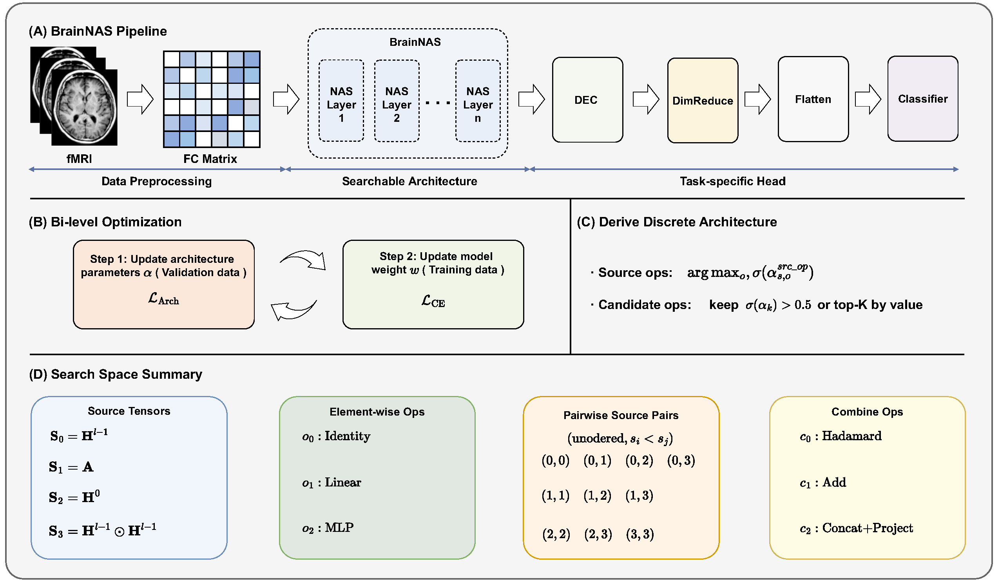

# BrainNAS: Neural Architecture Search for Brain Network Analysis

Brain‑network analysis plays a key role in studying neurological disorders and computer‑aided diagnosis. However, mainstream message‑passing paradigms (GNNs, Transformers) fit poorly with brain functional connectivity data: the Pearson correlation matrix acts as both graph topology and node features, limiting neighborhood aggregation and attention. Though the Brain Quadratic Network (BQN) solves this via Hadamard‑product quadratic operations, its hand‑crafted structure fails to adapt to diverse brain datasets, parcellation atlases and clinical tasks. We present BrainNAS, the first neural architecture search framework for brain‑network analysis to auto‑identify optimal architectures. It provides a layer‑wise search space with candidate operations. Searched architectures are discretized and retrained for evaluation. Tests over four datasets and two atlases covering autism, Parkinson’s disease and other neurological illnesses show BrainNAS surpasses hand‑designed BQN variants and message‑passing baselines to yield state‑of‑the‑art classification results. Ablation, visualization, interpretability and hyperparameter analyses confirm its efficacy and generalizability.



## Overview

BQN replaces message passing in brain network modeling with Hadamard-product-based
quadratic operations:

```
H^l = H^{l-1} ⊙ (A · W_A) + (H^{l-1} ⊙ H^{l-1}) · W_H
```

Instead of hand-designing this update rule, BrainNAS searches over a
strictly larger space of 42 candidate computations per layer:

- **Tensor sources** (4): `H^{l-1}`, `A` (adjacency / Pearson correlation), `H^0`
  (initial features / skip connection), `H^{l-1} ⊙ H^{l-1}` (quadratic term).
  
- **Element-wise ops** (3): Identity, Linear, MLP.

- **Combine ops** (3): Hadamard product, Addition, Concatenation+Projection.

- **Candidates per layer**: 12 unary (4 sources × 3 elem ops) + 30 binary
  (10 unordered source pairs × 3 combine ops) = **42**.


BrainNAS relies on a four-stage pipeline for searching, discretizing and validating brain network architectures. It first leverages gradient-based bi-level optimization with continuous relaxation to explore candidate architectures and regularize the learned continuous operation gates; the continuous gates are then discretized to obtain a fixed, interpretable standalone network structure. Next, the derived architecture is fully retrained from scratch under standard supervised training schemes with common augmentation and learning rate scheduling strategies, free of search-related auxiliary parameters. Finally, the full pipeline is repeated multiple times with distinct random seeds, and all evaluation metrics are summarized with mean and standard deviation to guarantee stable, reproducible results. 

## Problem Formulation and Brain Network Construction

We consider a dataset $\mathcal{D} = \{(G_i, y_i)\}{i=1}^{N}$ of $N$ subjects, where each brain network $G_i$ is constructed from resting-state fMRI through a standardized preprocessing pipeline: (1) parcellation of the brain into $R$ regions of interest (ROIs) using a validated anatomical atlas; (2) extraction of the mean BOLD signal time series $\mathbf{x}r \in \mathbb{R}^{T}$ for each ROI $r$, where $T$ is the number of acquisition time points; and (3) computation of the pairwise Pearson correlation coefficient between every pair of ROIs. 

The resulting symmetric matrix $\mathbf{A} = [a_{rs}] \in \mathbb{R}^{R \times R}$ simultaneously serves as the graph adjacency matrix (capturing the topological organization of functional connectivity) and the initial node feature matrix $\mathbf{H}^0 = \mathbf{A}$ (capturing the pairwise correlation profile of each ROI). Each subject carries a binary label $y_i \in \{0, 1\}$ indicating diagnostic status. Our objective is to learn a function $f: \mathbb{R}^{R \times R} \to \{0, 1\}$ that accurately classifies unseen subjects.

## Search Space Design

The search space is the foundation of any NAS framework. We designed a space that strictly generalizes the BQN operation set while remaining compact enough for efficient gradient-based search.

### Source Tensors

At each layer $l$, we construct four candidate source tensors $\mathcal{S} = \{\mathbf{S}_0, \mathbf{S}_1, \mathbf{S}_2, \mathbf{S}_3\} \in \mathbb{R}^{B\times N\times D}$:

$$
\begin{cases} 
\begin{aligned}
\mathbf{S}_0 &= \mathbf{H}^{l-1} &&\text{(previous hidden state)} \\
\mathbf{S}_1 &= \mathbf{A} &&\text{(adjacency matrix)} \\
\mathbf{S}_2 &= \mathbf{H}^{0} &&\text{(initial features)} \\
\mathbf{S}_3 &= \mathbf{H}^{l-1} \odot \mathbf{H}^{l-1} &&\text{(quadratic term)}
\end{aligned}
\end{cases}
$$

Two design choices here merit explicit justification. First, the inclusion of $\mathbf{S}_3 = \mathbf{H}^{l-1} \odot \mathbf{H}^{l-1}$ explicitly endows the search space with second-order interaction capacity. This preserves the key insight that quadratic operations are well-suited to brain connectivity data while allowing the NAS process to determine when and how to employ quadratic terms rather than mandating them at every layer. Second, the initial features $\mathbf{S}_2 = \mathbf{H}^0$ serve as a skip connection and provide a direct information pathway from the input layer to every subsequent layer. This design is motivated by the observation that the raw correlation matrix carries essential information that should not be attenuated through successive transformations; the skip connection enables the architecture to learn when to leverage raw correlation features directly.

### Element-wise and Combination Operations

Each source tensor can be transformed via one of three element-wise transformation operators $\mathcal{O}_{elem} = \{o_0, o_1, o_2\}$, whose mathematical formulations are defined as:

$$
\begin{cases} 
\textbf{Identity}\,(o_0): & \mathbf{T} = \mathbf{S}, \\
\textbf{Linear}\,(o_1): & \mathbf{T} = \mathbf{S}\mathbf{W}, \\
\textbf{MLP}\,(o_2): & \mathbf{T} = \text{ReLU}(\mathbf{S}\mathbf{W}_1)\mathbf{W}_2.
\end{cases}
$$

The first identity transformation operator ($o_0$) serves as a pass-through operation without any tensor transformation, enabling the model to preserve original source information when necessary. The second linear transformation operator ($o_1$) implements flexible recombination of input source features. The third nonlinear MLP transformation ($o_2$) is a two-layer perceptron, and it introduces nonlinearity, greatly enhancing the feature extraction capability of the network.

For a pair of transformed source tensors $\mathbf{T}_i$ and $\mathbf{T}_j$, three fusion operators $\mathcal{C} = \{c_0, c_1, c_2\}$ are adopted to generate fused candidate features, with specific formulas given as:

$$
\begin{cases} 
\textbf{Hadamard Product}\,(c_0): & \mathbf{C} = \mathbf{T}_i \odot \mathbf{T}_j, \\
\textbf{Add}\,(c_1): & \mathbf{C} = \mathbf{T}_i + \mathbf{T}_j, \\
\textbf{Concat and Project}\,(c_2): & \mathbf{C} = [\mathbf{T}_i \,||\, \mathbf{T}_j] \mathbf{W}_{proj}.
\end{cases}
$$

Hadamard product effectively models multiplicative interactive relationships between dual source tensors. The additive operation ($c_1$) is designed to integrate complementary additive feature information from different source tensors, supplementing multiplicative fusion patterns. The concat and project operation ($c_2$) is a learnable projection matrix. This operation realizes asymmetric and adaptive feature fusion, allowing differentiated weighting of the two input source tensors.

### Complete Candidate Set

Each layer’s full candidate library consists of 12 unary operators and 30 binary combinations, summing to 42 total candidate transformations. Formally, the unary count and binary candidates are defined as:

$$
\begin{align} 
\begin{cases} 
N_{\text{unary}} &= 4\,\text{src} \times 3\,\text{elem ops}, \\
N_{\text{binary}} &= \binom{4+2-1}{2}\,\text{unord pairs} \times 3\,\text{combine ops}.
\end{cases} 
\end{align}
$$

4 denotes the number of source tensors, multiplied by 3 element-wise operations for unary candidates. $\binom{5}{2}=10$ counts unordered source pairs with replacement, multiplied by 3 combination operations for binary candidates. The canonical BQN update rule constitutes a strict subset of our proposed search space. Specifically, it instantiates unary identity mappings for sources $\mathbf{S}_1$ and $\mathbf{S}_2$, fuses their outputs via Hadamard product, applies a second Hadamard fusion with $\mathbf{S}_0$, and concludes with a linear projection layer. This containment guarantees our search space is expressive enough to recover the original BQN formulation; beyond this baseline, it additionally enables discovery of novel architectures that preserve, adjust, or extend BQN’s core quadratic formulation in flexible, task-adaptive ways.

## Differentiable Architecture Search

## Graph-Level Readout via Deep Embedded Clustering

We adopt Deep Embedded Clustering (DEC) [xie2016dec] to aggregate node embeddings into a unified graph-level representation. Given final-layer node features $\mathbf{H}^L \in \mathbb{R}^{R \times D}$, DEC optimizes cluster centroids and soft assignment probabilities jointly by minimizing the KL divergence between a learned soft assignment distribution and an auxiliary target distribution. The soft assignment weight between node i and cluster centroid j is defined as

$$
q_{ij} = \frac{(1 + |\mathbf{h}_i - \boldsymbol{\mu}_j|^2)^{-1}}{\sum_{j'} (1 + |\mathbf{h}_i - \boldsymbol{\mu}_{j'}|^2)^{-1}},
$$

where $\mathbf{h}_i$ denotes the embedding of node i, and $\boldsymbol{\mu}_j$ stands for the centroid of cluster j. Graph-level embeddings are constructed by aggregating node features weighted by the derived soft cluster assignments. Two stabilizing regularizations from the original DEC framework are retained: an orthogonality constraint on cluster centroids $\boldsymbol{\mu}^\top \boldsymbol{\mu} = \mathbf{I}$ and fixed centroid parameters during optimization, both proven to stabilize clustering training [xie2016dec]. Beyond aggregation performance, this clustering-based readout offers strong interpretability. Visualization of learned cluster partitions exposes groupings of nodes sharing similar latent patterns, which reflects the structured relational patterns captured by our graph encoder. After clustering aggregation, we apply a lightweight non-linear dimensionality reduction module followed by a multi-layer perceptron for downstream classification.

## Vectorized Implementation for Efficient Search

Standard neural architecture search incurs substantial computational overhead when evaluating all candidate transformations at each training iteration. We mitigate this bottleneck via a fully vectorized forward-pass formulation for our NAS layer, formalized as follows. First, the four source tensors $\{\mathbf{S}_0,\mathbf{S}_1,\mathbf{S}_2,\mathbf{S}_3\} $ are stacked along the source dimension to form a unified batch tensor:

$$
\mathbf{S}_{\text{stack}} = \text{stack}\big(\mathbf{S}_0,\mathbf{S}_1,\mathbf{S}_2,\mathbf{S}_3\big) \in \mathbb{R}^{4 \times B \times N \times D}.
$$

All unary element-wise operations are applied in parallel over $\mathbf{S}_{\text{stack}}$ to produce a batched unary output tensor $\mathbf{T}_{\text{unary}}$. For binary combinations, precomputed index matrices $\mathbf{I}_{\text{pair}}$ retrieve paired source features without repeated lookup. We compute all binary fusion results simultaneously to obtain $\mathbf{T}_{\text{binary}}$. All candidate outputs are concatenated into a unified tensor $\mathbf{T}_{\text{all}} = \text{concat}(\mathbf{T}_{\text{unary}}, \mathbf{T}_{\text{binary}}) \in \mathbb{R}^{42 \times B \times N \times D}$. The layer output is then calculated via broadcasted weighted summation with normalized gate weights $\tilde{g}_k = g_k \big/\sum_j g_j$:

$$
\mathbf{H}^l = \sigma_{\text{act}}\left( \sum_{k=1}^{42} \tilde{g}_k \cdot \mathbf{T}_{\text{all}}[k,:,:,:] \right).
$$

This formulation removes all Python-level loops over sources, operator types and source pairs by relying entirely on native batched tensor arithmetic and broadcasting primitives, which drastically reduces runtime cost during architecture search.


## Pipeline

1. **Search** — bi-level optimization with FairDARTS (200 epochs): architecture
   parameters α are updated on the validation set with
   `L_arch = L_CE + λ · L_01`; model weights are updated on the training set.

2. **Derivation** — final-epoch sigmoid gates are thresholded into a discrete
   architecture (top-K operations per layer).

3. **Retraining** — the derived network is trained from scratch (200 epochs ×
   5 seeds) with mixup augmentation and cosine learning-rate scheduling.

4. **Evaluation** — ACC / AUC / SEN / SPEC reported as mean ± std over 5 runs.

   

## Installation

```bash
conda create -n dgl python=3.10 -y
conda activate dgl
pip install torch scikit-learn nilearn matplotlib seaborn
```

Data (`.npy` files containing `timeseries`, `corr`, `label`; `site` optional)
should be placed in the `--data_dir` directory. Supported naming conventions:

- Original BQN format: `abide.npy`
- Per-atlas format: `{dataset}_full_{atlas}.npy`, e.g. `taowu_full_AAL116.npy`

## Quick Start

```bash
# Single architecture search + retrain configuration
python main_nas.py \
    --dataset ABIDE \
    --batch_size 16 \
    --base_lr 1e-4 --weight_decay 1e-5 \
    --arch_lr 3e-3 \
    --layers 4 --top_k 4 --cluster_num 8 \
    --search_epochs 200 --epochs 200 \
    --zero_one_lambda 5.0 \
    --exp_name exp_demo
```

All results (search history, architecture files, per-run details, summary CSV)
are written to `result/{exp_name}/`.

## Hyperparameters

| Argument | Default | Description |
|----------|---------|-------------|
| `--zero_one_lambda` | 1.0 | Weight λ of the Zero-One regularization (paper: 5.0 / 10.0) |
| `--arch_lr` | 3e-4 | Architecture parameter learning rate η_α (paper: 1e-3..5e-3) |
| `--search_epochs` | 50 | Search epochs (paper: 200) |
| `--layers` | 3 | Number of NAS layers L |
| `--top_k` | 3 | Operations retained per layer after search |
| `--cluster_num` | 4 | DEC cluster count C |
| `--base_lr` / `--weight_decay` | 1e-4 / 1e-4 | Model optimizer settings for retraining |
| `--epochs` | 200 | Retraining epochs |
| `--runs` | 5 | Independent evaluation runs |

## Code Structure

```
BQN-NAS-FairDARTS/
├── main_nas.py          # Pipeline: search → derive → retrain → evaluate
├── parse_nas.py         # CLI arguments
├── train_search.py      # FairDARTS bi-level search loop (final-epoch derivation)
├── train_eval.py        # Derived-architecture retraining with mixup + cosine LR
├── utils_nas.py         # Multi-dataset data loading & utilities
├── model/
│   ├── nas_ops.py       # Search space: ops, combine ops, source-pair indices
│   ├── nas_layer.py     # FairDARTS layer: sigmoid gates + Zero-One loss
│   ├── nas_network.py   # Stacked searchable layers + DEC readout + classifier
│   └── nas_derived.py   # Architecture discretization & fixed network
└── result/              # Experiment outputs (one folder per exp_name)
```

## Results Format

Each experiment folder contains:

- `{dataset}_NAS.csv` — one row per hyperparameter configuration with ACC / AUC /
  SEN / SPEC (mean ± std) and the discovered architecture description.
- `architecture_{config_id}.txt` — human-readable per-layer architecture with
  sigmoid gate values.
- `search_history_{config_id}.csv` — per-epoch search metrics.
- `run_details_{config_id}.csv` — per-run metrics for the 5 evaluation seeds.
